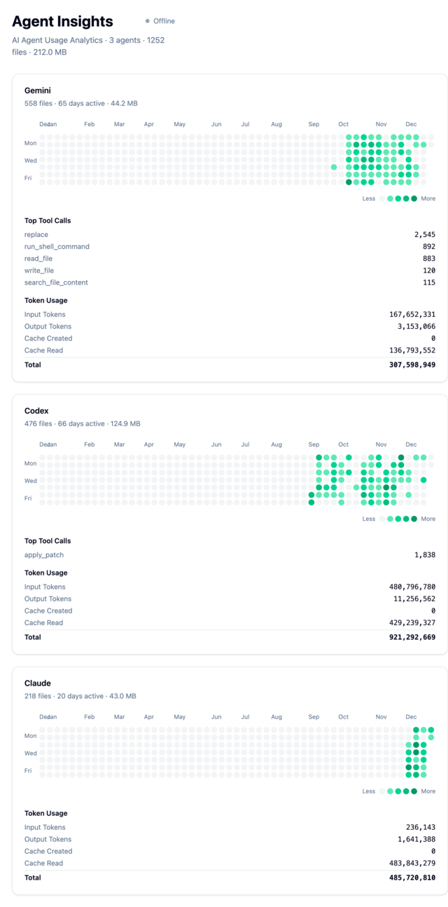

# Agent Insights

<p align="center">
  
  
  
  
</p>

A full-stack application for tracking and visualizing AI agent usage across Claude, Gemini, and Codex with GitHub-style heatmap charts.

## Overview

Agent Insights scans your local agent directories and provides beautiful visualizations of your usage patterns over time. See when you're most active with each AI agent, track file generation, and monitor storage usage.

## Privacy & Data Safety

Agent Insights is **fully local-first**:

- All data is scanned from your local filesystem
- No network requests, telemetry, or analytics
- No data is uploaded or shared
- You can safely run it completely offline

Your agent usage data never leaves your machine.



## Features

- **Multi-Agent Support**: Claude, Gemini, and Codex
- **GitHub-Style Heatmaps**: Year-long activity visualization per agent
- **Local-First & Offline**: No internet connection required
- **Fast Local Scanning**: Efficient filesystem traversal in Rust
- **Usage Analytics**: File count, activity frequency, and storage usage
- **Modern UI**: React + Tailwind CSS v4 + shadcn/ui
- **High-Performance Backend**: Rust + Axum

## Quick Start

### Download & Run (Prebuilt)

Download the latest binary from GitHub Releases:

https://github.com/milisp/agent-insights/releases

```bash
chmod +x ./agent-insights
./agent-insights
```

The server starts at:

- Backend API: http://127.0.0.1:3001

Open your browser and visit: http://127.0.0.1:3001

## Build from source

```sh
git clone https://github.com/milisp/agent-insights
cd agent-insights
```

### Prerequisites
- Rust 1.91 or newer
- Bun (for frontend)

### Backend

```bash
cargo run
```

Server starts on http://127.0.0.1:3001

### Frontend

```bash
cd ui
bun install
bun dev
```

UI opens at http://localhost:5173

## How It Works

1. Scans known local directories for supported AI agents
2. Parses JSON / JSONL session and file metadata
3. Aggregates activity by date and agent
4. Exposes a local HTTP API
5. Renders GitHub-style heatmaps in the frontend

### Example (curl)

```bash
curl http://127.0.0.1:3001/api/heatmaps
curl http://127.0.0.1:3001/api/heatmap/claude
```

## Development

Use `just` to start both backend and frontend, or run them separately:

## Contributing

Contributions are welcome!

- Bug reports and feature requests via GitHub Issues
- Pull requests for fixes, improvements, or new agent support
- Documentation improvements are highly appreciated

Please keep code comments in English and follow existing project structure.

## License

See [LICENSE](LICENSE) file for details.
